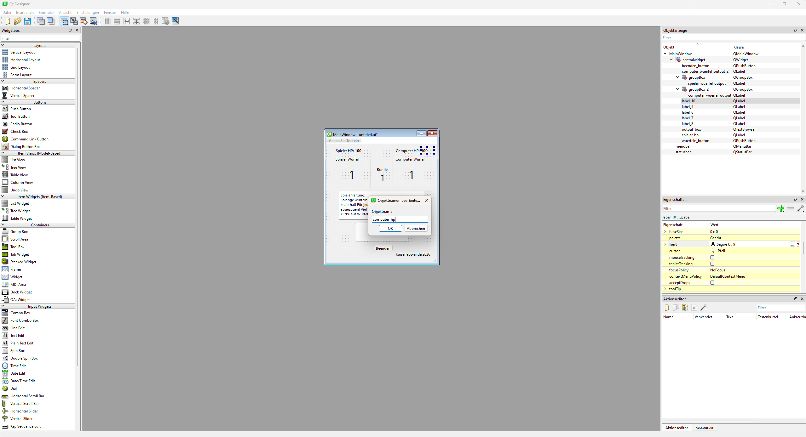
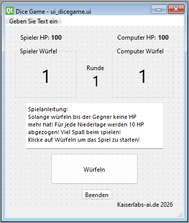
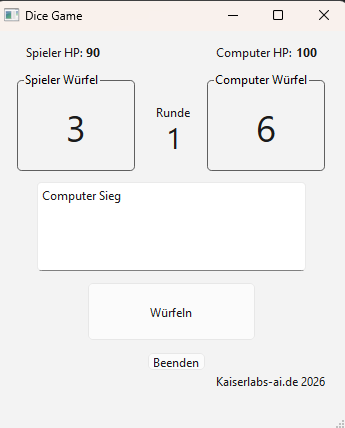

🎲 Dice Game – Python & PyQt6
Ein rundenbasiertes Würfelspiel mit grafischer Benutzeroberfläche, entwickelt in Python mit PyQt6.

Mein zweites abgeschlossenes Python-Projekt als Quereinsteiger – gebaut ohne KI-Hilfe.

📖 Spielprinzip
Spieler und Computer würfeln gegeneinander. Wer die niedrigere Zahl würfelt, verliert 10 HP.
Das Spiel endet wenn eine Seite keine HP mehr hat. Startwert: 100 HP pro Seite.

🚀 Features

Grafische Benutzeroberfläche mit PyQt6
HP-System mit Rundenanzeige
Automatische Auswertung pro Runde
Endscreen mit Ergebnis und Rundenzahl
Automatischer Reset nach Spielende
Reaktive Computerkommentare nach jeder Runde (in Entwicklung)

🛠️ Technischer Stack
KomponenteDetailsSprachePython 3.10+UI-FrameworkPyQt6UI-DesignQt Designer (.ui-Datei)ZufallszahlenPython random Modul

🏗️ Projektstruktur
Dice_Game/
├── main.py              # Einstiegspunkt der Anwendung
├── dicegame.py          # Spiellogik (Würfeln, Auswertung, HP-Verwaltung)
├── dicegame_ui.py       # UI-Klasse und Ereignissteuerung
└── ui_dicegame.ui       # Qt Designer Layout-Datei

🔧 Architektur
Das Projekt trennt bewusst Spiellogik und UI-Logik:

dicegame.py – enthält ausschließlich die Spielmechanik, kein UI-Code
dicegame_ui.py – enthält ausschließlich die UI-Steuerung, keine Spiellogik
Datenaustausch zwischen den Schichten erfolgt über Dictionaries

Screenshots:

▶️ Installation & Start
Voraussetzungen:
pip install PyQt6
Starten:
python main.py

📈 Lernziele dieses Projekts

Trennung von Logik und UI in getrennten Klassen
Datenaustausch zwischen Klassen mit Dictionaries
Zustandsverwaltung über eigene Methoden
Fehlerbehandlung und Reset-Logik
Anwendung von OOP-Prinzipien in einem vollständigen Projekt

👨‍💻 Über den Entwickler
Quereinsteiger aus der Altenpflege, seit Anfang 2026 aktiv Python lernend.
Dieses Projekt wurde ohne KI-Unterstützung entwickelt.
GitHub Profil | LinkedIn | Kaiserlabs-ai.de Software 2026
